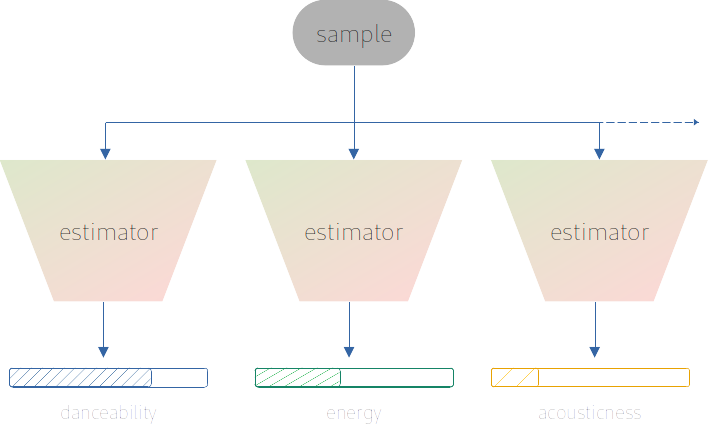

# Weather influence on music

The prototype in this repository was created during a data science training. Idea, concept, implementation and evaluation have been done by me. 

## Purpose

Music, like art, lies in the eye of the beholder. Estimating what songs a person likes can be considered as a non-trivial task. Even under a genre usually prefered by the individual, the hit rate could often fall short of expectations of any recommendation. The reason someone is skipping a track may have various reasons. One could not be in the mood, listen too frequently to it, or listens to it the first time, or simply doesn't match one's taste, to name a few. Still there are many platforms with a business plan of selling music via streaming or as a album retailer. In order to improve the user experience, recommendation strategies have to be implemented, in order to avoid annoying the user by constantly advertising unrelated content.

This study considers retrieving such recommendation hints, based on meterological events. As the weather takes influence on humans, at least on the mood, it probably also has consequences on wether we rather would like to tune in to something relaxing or more powerfull. 

## Strategy and learning target

The [Million Musical Tweets Dataset](http://www.cp.jku.at/datasets/MMTD/) composed by the Johannes Kepler University of Linz gathered many broadcasted messages of individuals, containing what they are listening to. Along the title and artist, there's also listed the location, date and time.

This location and timing information then can be used to look up historical meterological data with the help of [Open-Meteo](https://open-meteo.com/en/docs/historical-weather-api/).

These two data sources, are yet not enough. In order to give more general estimates, a third one is required describing these songs. As each individual comes with a different taste in music, it's rather difficult to directly take these titles as a learning target. Though if the music attributes can be described on a more abstract level, this information could then be taken to look up suggestions in the scope of the individual's preferences. That's where the [Spotify API](https://developer.spotify.com/documentation/web-api) comes in handy, which provides information like how *danceable* or *speechy* a track is.

## Data Acquistion

A million musical tweets is a relatively big data basis. When each of these samples would be analyzed it would overstrain the basic usage plan of the APIs. Upgrading the API-plan certainly would solve that, however for a proof of concept this might not be necessary. To put it in perspective, here's an overview from where in the world data has been collected

Hence in order to keep a certain diversity in the result and not being to focused on a specific group of people, for this research a subset was created containing the data from the european area. This area was choosen as it comes with two advantages: 

- within this area a large amount of completely different cultures can be found 
- the meterological situations are very different from country to country

In other words this covers a big variety to draw conclusions from, to eventually give better generalized estimates. In the following picture the locations are shown, of the samples that are actually used for evaluation.

### Dataset composition

From the MMTD only the *tweet.zip*, *track.zip* and *artist.zip* are used. Each of them cover a necessary detail, while for *track.zip*  and *artist.zip* the name already gives away the content, the remaining information about geo-location, date and time are extracted from *tweet.zip*.

With this the weather information can be collected from a certain date back in time via Open Meteo. From there per sample the following features are extracted:

- Temperature 2 m - Air temperature at 2 meters above ground.
- Relative humidity 2 m - Relative humidity at 2 meters above ground
- Rain - Rain from large scale weather systems of the preceding hour in millimeter.
- Weather code - Weather condition as a numeric code. Follow WMO weather interpretation codes.
- Cloud cover - Total cloud cover as an area fraction.
- Wind speed 10 m - Wind speed at 10 meters above ground.
- Daylight duration - Number of seconds of daylight.
- Sunshine duration - Number of seconds of sunshine.

There are even more possible features to fetch, however they don't always match the ones from today's weather data (e.g. `Soil Moisture (0-7 cm)` for data from the past vs `Soil Moisture (0-1 cm)` for today's information). Leaving those out to avoids a possible feature impurity, which prevents learning a different character that confuses the prediction. Also from the point of view for a a proof of concept study, it is an appropriate amount of feature to describe how the weather conditions were.

From Spotify in turn we can extract features like

- acousticness
- danceability
- energy
- instrumentalness
- liveness
- loudness
- mode
- speechiness
- tempo
- valence

if predicted right, this set should provide enough parameters to filter out matching song. 

## Data inspection & training

The goal is to learn Spotify features with weather information from Open-Meteo.

Before that, a dataset analysis will give an insight whether any classifier can provide a solid estimate at all, or if the samples don't differentiate at all.

### Artists 

Here's an overview about the artist distribution

As by their nature, it expectedly shows that the ones from the pop-genre stand out the most frequently in their amount of references. But it also points out a rather broad spectrum, when looking at artists like *Korn*, *Aha*, or *Bob Marley*. Which stands for a good learning basis to achieve a general understanding than being focused on a few sub-groups.

### Song descriptors

Having a wider range per feature shows a large variety of song types. Which is good for a learning approach, as not only similar but much more different songs (i.e. more unique compared to each other) are recorded. This indicates a good information gain sufficient for learning. 

The song features to the relevant songs, come with following distribution

### Weather descriptors

The distribution here looks like a good basis for interpretation in general, as the values are well spread. The closer the samples would be located within a certain feature to each other, the less difficult it is to train a regressor, but also most likely less reliable information can be derived from resulting estimates (as there are less cases to differentiate).

### Training strategy

Learning to estimate floating values like the target characteristics, is a typical task for machine learning regression.

From many algorithm options a *Decision Tree Regressor* is chosen. The performance of such estimators often times hold back when compared to neural networks. Though what speaks for it is amongst others

- a mangeable amount of optimization parameters.
- out of the box usage (when a library like scikit-learn is used).
- known for well handling of categorical data.
- quickly trained.

all in all, a good match for building a rapid-prototype and getting a feeling how well the matter is learnable. This way the time to first results is greatly decreased.

Defining the kind of estimator is one step, the next is the learning target. As already mentioned, in the end, Spotify's music descriptors should be learned. For each of those descriptors an individual estimator, with a separate training needs to be provided, still with the same data basis. This is sketched like

The functional performance of each estimator is optimized, by the possible algorithm parameters via a grid search. 

## Results & Outlook

With the setting described above, after cleaning the dataset each estimator gets fed with 3472 samples for training, which are split into a training set (77% of the data) and the rest for testing. To evaluate the functional performance, a root mean square error a common metric for regression prediction.

Below are the results of the optimized regressors

| Descriptor        | Root mean square error    |
|-------------------|---------------------------|
| danceability      | 0.2                       | 
| energy            | 0.2                       |
| loudness          | 2.9                       |
| mode              | 0.5                       |
| acousticness      | 0.2                       |
| speechiness       | 0.1                       |
| instrumentalness  | 0.2                       |
| liveness          | 0.2                       |
| valence           | 0.2                       |
| tempo             | 26.2                      |

An overall satisfying result for such a prototype. The underperformance for descriptor *tempo* probably is caused, since all other options occur in all BPM-ranges and thus no destinctive characteristics could be extracted. 

### Application in a real scenario

As promising these results may look, after all these won't exactly show how well the approach works out if it is really applied. This is not covered by this metric. There are different reasons to this, where one of them probably is that explaining the prefered music choice of an individual is not a trivial task. Though it could help to increase the focus on the relevant ones.

That being said, the investigations above can only be taken as an approximation, an educated guess whether this approach is applicable in general. To measure the actual performance an experiment needs to be performed, by separating a set of users in two groups. The one group perceives the recommendations as they were before, while the other group perceives the recommendation almost the same, except of the recommendations are inspired by the results of the estimators. This is then carried out a few monts or even a year long, just to make sure a large variance of weather conditions is recorded. Eventually the user satisfaction is compared and the better option should be kept accordingly. 

How this satisfaction ultimately is measured, depends on where the algorithm is applied. For instance, a streaming radio station could compare the numbers of listeners. While on-demand services, like Spotify, could measure if and what UI controls are used (if the track was skipped or the volume was increased). This approach is widely known as a so called A/B-test.

### Further optimization

This algorithm can be further improved in different ways.

**On algorithm side**:

- A more advanced yet still very swift version of a decision tree, is a special ensemble: the *Random Forest*. It might already bring a performance boost without a preparation time, besides the actual training.
- Though if it is seriously considered to apply this approach, more modern estimators, probably based on neural networks, should be evaluated.
- A trailing estimator might take the results of the other regressors and estimate how relevant each music descriptor was to look for the song (which would replace the manual selection of features in this repo's web-UI)

**On data side**:

- First and foremost the full survey data should be used, to better differentiate the cases.
- Further meterological features could be used for training
- Next to weather features, the geo coordinates probably would help a lot to better differentiate at least culture differences, as they usualy are often close to each other.