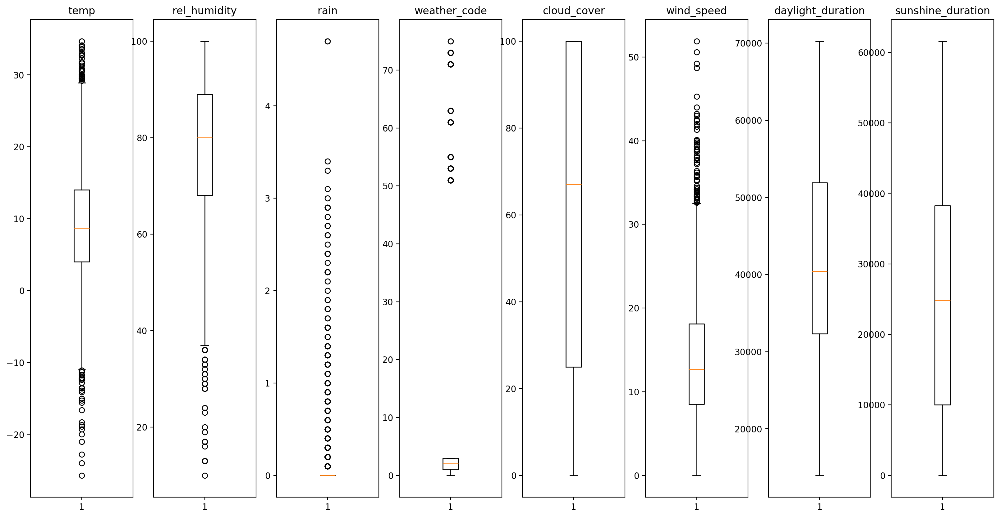

# Weather influence on music

The prototype in this repository was created in my free time in less than a month as part of a data science training. Idea, concept, implementation and evaluation have been done by me. 

## Table of contents

<!-- TOC -->

- [Weather influence on music](#weather-influence-on-music)
    - [Table of contents](#table-of-contents)
    - [Purpose](#purpose)
    - [Strategy and learning target](#strategy-and-learning-target)
    - [Data Acquisition](#data-acquistion)
        - [Dataset composition](#dataset-composition)
    - [Data inspection & training](#data-inspection--training)
        - [Artists](#artists)
        - [Song descriptors](#song-descriptors)
        - [Weather descriptors](#weather-descriptors)
        - [Training strategy](#training-strategy)
            - [Estimator choice](#estimator-choice)
            - [Object of training](#object-of-training)
            - [Functional Optimization](#functional-optimization)
    - [Results & Outlook](#results--outlook)
        - [Application in a real scenario](#application-in-a-real-scenario)
        - [Further optimization](#further-optimization)
    - [Acknowledgement](#acknowledgement)

<!-- /TOC -->

## Purpose

Music, like art, lies in the eye of the beholder. Estimating what songs a person likes can be considered as a non-trivial task. Even under a genre usually preferred by the individual, the hit rate could often fall short of expectations of any recommendation. The reason someone is skipping a track may have various reasons. One could not be in the mood, listen too frequently to it, or listens to it the first time, or simply doesn't match one's taste, to name a few. Still there are many platforms with a business plan of selling music via streaming or as a album retailer. In order to improve the user experience, recommendation strategies have to be implemented, in order to avoid annoying the user by constantly advertising unrelated content.

This study considers retrieving such recommendation hints, based on meterological events. As the weather takes influence on humans, at least on the mood, it probably also has consequences on wether we rather would like to tune in to something relaxing or more powerful. 

## Strategy and learning target

The [Million Musical Tweets Dataset](http://www.cp.jku.at/datasets/MMTD/) composed by the Johannes Kepler University of Linz gathered many broadcasted messages of individuals, containing what they are listening to. Along the title and artist, there's also listed the location, date and time.

This location and timing information then can be used to look up historical meterological data with the help of [Open-Meteo](https://open-meteo.com/en/docs/historical-weather-api/).

These two data sources, are yet not enough. In order to give more general estimates, a third one is required describing these songs. As each individual comes with a different taste in music, it's rather difficult to directly take these titles as a learning target. Though if the music attributes can be described on a more abstract level, this information could then be taken to look up suggestions in the scope of the individual's preferences, in the sense of a mapping. That's where the [Spotify API](https://developer.spotify.com/documentation/web-api) comes in handy, which provides information like how *danceable* or *speechy* a track is.

Those Spotify features are used to train a regression algorithm (details are discussed in chapter [training strategy](#training-strategy)). Finally the estimates can then be used to look up songs that have been categorized in similar ranges.

This is briefly summarized within the graphic below (the actual usage takes more than just 3 Spotify track features)

Adequately for a prototype, public libraries have been used and the most relevant ones within this project are:

-   [pandas](https://pandas.pydata.org/) is utilized as the common data handling framework for swift analyzing and processing.
-   [scikit-learn](https://scikit-learn.org/stable/) covers training and evaluating the estimators.
-   [matplotlib](https://matplotlib.org/) for visualizations and graphs.
-   [flask](https://flask.palletsprojects.com/) as a web framework for the user interface and interaction.

The choice for such prominent Python packages is due to they are comparably well tested, optimized and ready to be used.

## Data Acquisition

A million musical tweets is a relatively big data basis. When each of these samples would be analyzed, it would overstrain the basic usage plan of the APIs. Upgrading the API-plan obviously would solve that, however for a proof of concept this might not be necessary. To put it in perspective, here's an overview from where in the world data has been collected

Hence in order to keep a certain diversity in the result and not being too focused on a specific group of people, for this research a subset was created containing the data from the european area. This area was chosen as it comes with two advantages: 

- within this area a large amount of completely different cultures can be found 
- the meterological situations are very different from country to country

In other words this covers a big variety to draw conclusions from, to eventually give better generalized estimates. In the following picture the locations are shown, of the samples that are actually used for evaluation.

### Dataset composition

From the MMTD only the *tweet.zip*, *track.zip* and *artist.zip* are used. Each of them cover a necessary detail, while for *track.zip*  and *artist.zip* the name already gives away the content, the remaining information about geo-location, date and time are extracted from *tweet.zip*.

With this the weather information can be collected from a certain date back in time via Open Meteo. From there per sample the following features are extracted:

- Temperature 2 m - Air temperature at 2 meters above ground.
- Relative humidity 2 m - Relative humidity at 2 meters above ground
- Rain - Rain from large scale weather systems of the preceding hour in millimeter.
- Weather code - Weather condition as a numeric code. Follow WMO weather interpretation codes.
- Cloud cover - Total cloud cover as an area fraction.
- Wind speed 10 m - Wind speed at 10 meters above ground.
- Daylight duration - Number of seconds of daylight.
- Sunshine duration - Number of seconds of sunshine.

There are even more possible features to fetch, however they don't always match the ones from the API of today's weather data (e.g. `Soil Moisture (0-7 cm)` for data from the past vs `Soil Moisture (0-1 cm)` for today's information). These are left out to avoid a possible feature impurity, which prevents learning a different character that confuses the prediction. Also from the point of view for a a proof of concept study, it is an appropriate amount of features to describe how the weather conditions were.

From Spotify in turn we can extract features like

- acousticness
- danceability
- energy
- instrumentalness
- liveness
- loudness
- mode
- speechiness
- tempo
- valence

if predicted right, this set should provide enough parameters to filter out matching song. 

## Data inspection & training

In data science it often times occurs that datasets come with missing values and need a special pre-processing that handle these spots. Approaches like dropping a row or interpolation are prominent actions for this. If this would have been ignored, as a consequence in the best case the application crashes, and one would immediately know what has to be fixed. In worser scenarios the performance gets  decreased without notification. Though the data within this project, either is complete (like MMTD) or gets dropped if unexpected values occur (like song lookups). So that in the end the final dataset has no missing values, which is also checked and ensured at the very end of the data processing.   

The goal is to learn Spotify features with weather information from Open-Meteo. Before that, a dataset analysis will give an insight whether any classifier can provide a solid estimate, or if the samples don't differentiate at all.

For gaining a better insight about the data, two visualization options are used wherever possible:

- box plots: to point out density and especially outliers.
- violin plots: that give a more detailed insight about the distribution and local density.

All samples are within expectable ranges, no real song- and weather-feature outliers are detectable - that is 0..1 for the song features, BPM ranges for the tempo, dB ranges for loudness and a weather data one would expect to receive from a meterological office.

However it also shows that certain features like *speechiness* are a bit underrepresented within certain ranges, and should not be filtered in the upper area, as one would do for outliers. Rather, as a step of optimization, more samples should be included that fulfill that criteria, as these are valid values, which eventually would increase the functional performance of the learned algorithm. Which shows potential for improvement if the prototype phase is exited.

### Artists 

Here's an insight about the most frequent artists

As by their nature, it expectedly shows that the ones from the pop-genre stand out as the most frequent ones in their amount of references. But it also points out a rather broad spectrum, when looking at artists like *Korn*, *Aha*, or *Bob Marley*. Which stands for a good learning basis to achieve a general understanding than being focused on a few sub-groups.

### Song descriptors

Having a wider range per feature shows a large variety of song types. Which is good for a learning approach, as not only similar but much more different songs (i.e. more unique compared to each other) are recorded. This indicates a good information gain sufficient for learning. 

The song features to the relevant songs, come with following distribution

### Weather descriptors

The distribution here looks like a good basis for interpretation in general, as the values are well spread. The closer the samples would be located within a certain feature to each other, the less difficult it is to train a regressor, but also most likely less reliable information can be derived from resulting estimates (as there are less cases to differentiate).

### Training strategy

Learning to estimate floating values like the target characteristics, is a typical task for machine learning regression.

#### Estimator choice

From many algorithm options a [Decision Tree Regressor](https://scikit-learn.org/stable/auto_examples/tree/plot_tree_regression.html#sphx-glr-auto-examples-tree-plot-tree-regression-py) is chosen. In general these kind of estimators build up a structure of if/else-decisions, where on each branch one single feature is evaluated, whether it's higher or lower a certain (trained) threshold. It then subsequently gets evaluated another time, depending on the categorization that happened one step before. It is repeated until eventually the end of the route was reached with the actual estimate, a floating value for regression.

The performance of such estimators often times hold back when compared to neural networks. Though what speaks for it amongst other benefits is

- a manageable amount of optimization parameters.
- out of the box usage (when a library like scikit-learn is used).
- known for well handling of categorical data.
- quickly trained.

All in all, a good match for building a rapid-prototype and getting a feeling how well the matter is learnable. This way the time until the first results are received, is greatly decreased. In this project the decision tree library is utilized from [scikit-learn](https://scikit-learn.org/stable/modules/generated/sklearn.tree.DecisionTreeRegressor.html)

#### Object of training

Defining the kind of estimator is one step, the next is the learning target. As already mentioned, in the end, Spotify's music descriptors should be learned. For each of those descriptors an individual estimator, with a separate training needs to be provided, still with the same data basis. This is sketched in the following

#### Functional Optimization

The functional performance of each estimator is individually optimized, by grid search on these parameters:

| Parameter         | Description                               | Options               | Rational                       |
|-------------------|-------------------------------------------|-----------------------|--------------------------------|
| criterion         | Function to measure the quality of split  | all categories        | check everything               |
| splitter          | Splitting strategy on each node           | all categories        | check everything               |
| max depth         | Maximum of splits per path (tree depth)   | 1 .. 20               | Very deep trees tend to overfit|
| min samples split | Minimum of samples required to split      | 2 .. 10               | Avoid 1-time-sample-*outliers*  larger number require a bigger dataset |
| max features      | Number of features to consider for split  | 1 .. number of features     | check everything               |

More details about the parameters can be found at the [source](https://scikit-learn.org/stable/modules/generated/sklearn.tree.DecisionTreeRegressor.html#sklearn.tree.DecisionTreeRegressor). In the scope of building a prototype, further options have not been evaluated yet. In order to keep down implementation errors, the well tested [GridSearchCV](https://scikit-learn.org/stable/modules/generated/sklearn.model_selection.GridSearchCV.html#sklearn.model_selection.GridSearchCV) with default settings was used.

## Results & Outlook

With the setting described above, after cleaning the dataset each estimator gets fed with 3472 samples for training, which are split into a training set (77% of the data) and the rest for testing. 

To evaluate the functional performance, a root mean square error is used, a metric that is usually used for regression prediction. It shows how close the individual estimates were regarding their ground truth comparison value, in other words the lower the number the more accurate the estimator operates.

Below are the results of the optimized regressors

| Descriptor        | Root mean square error    | Max. Error    |
|-------------------|---------------------------|---------------|
| danceability      | 0.15                      | 0.51          |
| energy            | 0.19                      | 0.69          |
| loudness          | 2.89                      | 22.06         |
| mode              | 0.49                      | 0.86          |
| acousticness      | 0.23                      | 0.84          |
| speechiness       | 0.08                      | 0.49          |
| instrumentalness  | 0.16                      | 0.92          |
| liveness          | 0.15                      | 0.79          |
| valence           | 0.23                      | 0.48          |
| tempo             | 26.04                     | 92.12         |

An overall satisfying result for such a prototype. At the same time the max. error shows there are situations where the prediction was not reliable, hence room for improvement. 

The under performance for descriptor *tempo* probably is caused, since all sorts of music occur in almost all BPM-ranges and thus no distinctive characteristics could be extracted. The reason for *loudness* to score comparably lower, might be because the others are only estimating values in range 0 .. 1, while loudness has a much bigger space for estimating a dB scale (considering a finite floating precision range) causing a much less dense prediction values distribution.

For these estimators the best configuration is listed below

| Descriptor        | criterion     | max. depth    | max. features | min. samples split| splitter  |
|-------------------|---------------|---------------|---------------|-------------------|-----------|
| danceability      | poisson       | 3             | 2             | 7                 | random    |
| energy            | poisson       | 1             | 7             | 4                 | random    |
| loudness          | squared error | 4             | 1             | 8                 | random    |
| mode              | friedman mse  | 2             | 4             | 7                 | best      |
| speechiness       | friedman mse  | 3             | 3             | 5                 | random    |
| acousticness      | squared error | 3             | 3             | 6                 | random    |
| instrumentalness  | poisson       | 2             | 3             | 2                 | random    |
| liveness          | poisson       | 2             | 1             | 7                 | best      |
| valence           | squared error | 2             | 3             | 5                 | random    |
| tempo             | poisson       | 2             | 3             | 8                 | random    |

Feature importance for each estimator are subsequently visualized

From this overview one can see it is not only one or a very few important feature(s), but a mix that lead to a good estimate. This in turn means, more weather features could be added with the goal to add a more distinctive one - if there is any.

### Application in a real scenario

As promising these results may look, after all these won't exactly show how well the approach works out if it is really applied. This is not covered by this metric. There are different reasons to this, where one of them probably is, that explaining the preferred music choice of an individual is not a trivial task. Though it could help to increase the focus on the relevant ones.

That being said, the investigations above can only be taken as an approximation, an educated guess whether this approach is applicable in general. To measure the actual performance an experiment needs to be performed, by separating a set of users in two groups. The one group perceives the recommendations as they were before, while the other group perceives the recommendation almost the same, except of the recommendations are inspired by the results of the estimators. This is then carried out a few months or even a year long, just to make sure a large variance of weather conditions is recorded. Eventually the user satisfaction is compared and the better option should be kept accordingly. 

How this satisfaction ultimately is measured, depends on where the algorithm is applied. For instance, a streaming radio station could compare the numbers of listeners. While on-demand services, like Spotify, could measure if and what UI controls are used (e.g. if the track was skipped or the volume was increased). This approach is widely known as a so called A/B-test.

### Further optimization

This algorithm can be further improved in different ways.

**On algorithm side**:

- A more advanced yet still very swift version of a decision tree, is a special ensemble: the *Random Forest*. It might already bring a performance boost without a further preparation time, besides the actual training.
- Though if it is seriously considered to apply this approach, more modern estimators, probably based on neural networks, should be evaluated.
- A trailing estimator might take the results of the other regressors and estimate how relevant each music descriptor was to look for the song given by the sample (which would replace the manual selection of features in this repo's web-UI)

**On data side**:

- First and foremost the full survey data should be used, to better differentiate the cases.
- Further meterological features could be used for training.
- Include more songs that represent the individual song features ranges more evenly.
- Next to weather features, the geo coordinates probably would help a lot to better distinguish at least culture differences, as they usually are often close to each other.

## Acknowledgement

|                                   |                                                                       |
|-----------------------------------|-----------------------------------------------------------------------|
| **Survey Dataset**                | The Million Musical Tweets Dataset - What We Can Learn From Microblogs Hauger, D. and Schedl, M. and Košir, A. and Tkalčič, M. Proceedings of the 14th International Society for Music Information Retrieval Conference (ISMIR 2013), Curitiba, Brazil, November 2013. |
| **Spotify song database API**     | https://developer.spotify.com/                                        |
| **Open-Meteo weather database API**| https://open-meteo.com/                                              |
