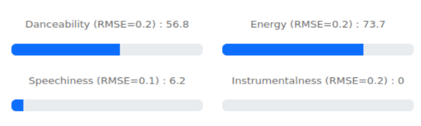

# Weather influence on music

This is a concept study, that works out what music preferences an individual likes to listen to, stimulated to their surrounding weather condition. 



## Table of contents

<!-- TOC -->

- [Weather influence on music](#weather-influence-on-music)
    - [Table of contents](#table-of-contents)
    - [Concept](#concept)
    - [State of implementation](#state-of-implementation)
    - [Application](#application)
        - [Initial setup](#initial-setup)
        - [User Interface](#user-interface)
        - [SurveyHandling](#surveyhandling)
        - [SongAttributes](#songattributes)
        - [WeatherRequests](#weatherrequests)
        - [RelationAnalytics](#relationanalytics)
    - [File Description](#file-description)

<!-- /TOC -->

## Concept

Have a look at the [project description](PROJECT.md) for further details.

## State of implementation

The code is in a stage of *proof of concept*.

It has been successfully executed on Windows11 and Debian12

## Application

There are mainly two parts:
- one for data aquisition, training and general preparation. 
- and the other for the demo with user interface and interatction.

In the user interface a user can 

1. type in his geolocation.
2. receive meterological data for that region, even manipulate that data.
3. receive suggestions what kind of music would be appropriate.
4. get some matching examples from the dataset. 

**Note**: with the provided data in this repo one can already start the user interface with all features. No preparations like training are necessary for this. If you would like to run the steps on your own, you need to provide Spotify API 
credentials, as the ones in the code have been deactivated. Depending on your machine all steps require ~ 1 day processing time.

Below is an overview of the individual parts and how to interact with them

### Initial setup

After the repo has been cloned locally, the required python packages need to be installed that are summarized in the `packages.txt`. 

**Note**: it is recommended to work with a dedicated virtual environment on that matter.

```
python3 -m pip install -r packages.txt
```

### User Interface

The user inteface holds the interaction with the song estimators. To execute it, one has to run

```
python3 web_interface.py
```

and follow the instructions in the terminal.

Requires:
- song database (*full_data.p*)
- regressors  (*clfs.p*)

### SurveyHandling

This part processes and extracts relevant data from the *Million Musical Tweets Dataset*: what user listened where and when to which track.

```
python3 pipelines\SurveyHandling.py
```
No input data needed.

Exports:
- listening statistics (*survey_data.p*)
- statistics and visualizations (*analytics/*)

### SongAttributes

Here the songs are looked up in Spotify's database for their individual features. It showed that the API isn't always working stable so running it a multiple times might be necessary, but the scripts are prepared to handle these situations.

```
python3 pipelines\SongAttributes.py
```
Requires:
- listening statistics (*survey_data.p*)

Exports:
- intermediate states to continue on an intended or unintended early exit (*song_ids.csv*)
- song features (*song_attribute_data.p*)

### WeatherRequests

Gathers the meterological data to the songs under investigation. Since it might be that Spotify can't look up a song, both *SurveyHandling* and *SongAttributes* need to be run beforehands.

```
python3 pipelines\WeatherRequests.py
```
Requires:
- song features (*song_attribute_data.p*)
- listening statistics (*survey_data.p*)

Exports:
- weather information (*weather_data.p*)

### RelationAnalytics

As a final step, this is where all the data gets combined. Here for each music attribute of a song an individual regressor is trained, on basis of the related weather conditions.

```
python3 pipelines\RelationAnalytics.py
```
Requires
- weather information (*weather_data.p*)
- listening statistics (*survey_data.p*)
- song features (*song_attribute_data.p*)

Exports:
- a set of regressors (*clfs.p*)

## File Description

The repo contains following files

| File                              | Description                                                   |
|-----------------------------------|---------------------------------------------------------------|
| analytics/artist_distribution.png | What artists are presend in the survey dataset (graph)        |
| analytics/artist_distribution.csv | What artists are present in the survey dataset (data)         |
| analytics/country_distribution.png| From where in the world the training samples have been extracted |
| analytics/general_country_distribution.png | From where in the world samples generally could be extracted |
| analytics/date_distribution.csv   | What dates are present in the survey dataset                  |
| analytics/feature_importance_*.png | What weather feature is important for each regressor          |
| analytics/how_much_data_is_missing.csv | Overview about missing values in the dataset             |
| analytics/song_descriptor_distribution_* | How the samples are distributed within the individual features |
| analytics/weather_descriptor_distribution_* | How the weather features are distributed for the related samples |
| dataset/                          | Export directory, where the raw survey data is exported to    |
| doc_assets/                       | Directory with images especially for integration into documents |
| pipelines/common.py               | A central configuration of commonly shared variables & functions |
| pipelines/SurveyHandling.py       | Downloads the survey data and turns it into a DataFrame       |
| pipelines/SongAttributes.py       | Takes the songs from survey and looks up the Spotify features |
| pipelines/WeatherRequests.py      | Takes the date & location of survey sampels and looks up meterological data |
| pipelines/RelationAnalytics.py    | Combines all data, analyses and trains the regressors         |
| states/*                          | Export directory with pickle files to save intermediate states|
| UI/                               | Flask / Web User interface of the application demonstrator    |
| web_interface.py                  | Entry point to start the demonstrator above                   |
| packages.txt                      | List of python packages in order to run the scripts           |
| README.md                         | You are currently reading this file                           |
| PROJECT.md                        | Project description, ideas and discussion                     |
